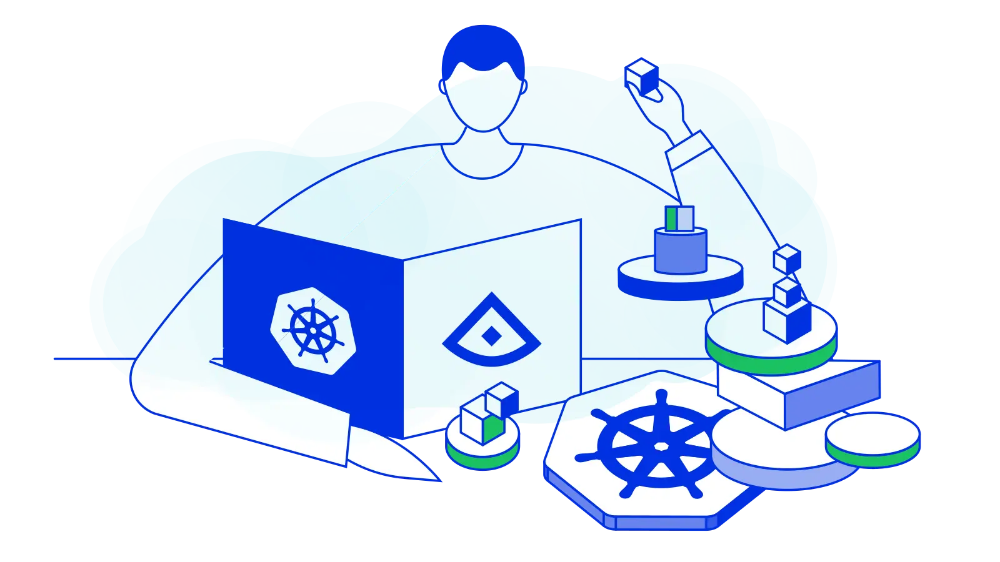

## Autoscaling in Kubernetes

  

    
  

  Auto-scaling là cách thức tăng/giảm hợp lý tài nguyên của hệ thống trong bất
kỳ thời điểm nào khi cần. Điều này nhằm giúp cho hệ thống có khả năng mở rộng
24/24 và đáp ứng nhu cầu sử dụng.

  *"Kubernetes autoscaling helps optimize resource usage and costs by automatically scaling a cluster up and down in line with demand"*

  Các nền tảng *cloud* khác nhau sẽ có các tính năng riêng để thực hiện auto-scaling.
Đối với *kubernetes* có 3 phương thức auto-scaling chính:
  * **Horizontal Pod Autoscaling (HPA)**: *which is sometimes referred to as “scaling out”*
  cho phép tăng/giảm tự động số lượng các *pods* đang chạy khi có sự thay đổi.
  * **Vertical Pod Autoscaling (VPA)**: Khác với HPA là thay đổi về số lượng *pods*
  VPA xác định dựa trên tính toán để thay đổi tài nguyên (CPU, memory, ...) của
  máy tính.
  * **Cluster Autoscaling (CA)**: Humm... Để sau

## Reference

- [Kubernetes autoscaling, explained](https://enterprisersproject.com/article/2021/3/kubernetes-autoscaling-explanation)
- [Horizontal Pod Autoscaling in Kubernetes](https://www.giantswarm.io/blog/horizontal-autoscaling-in-kubernetes)

[me](https://ductn.info/about)
