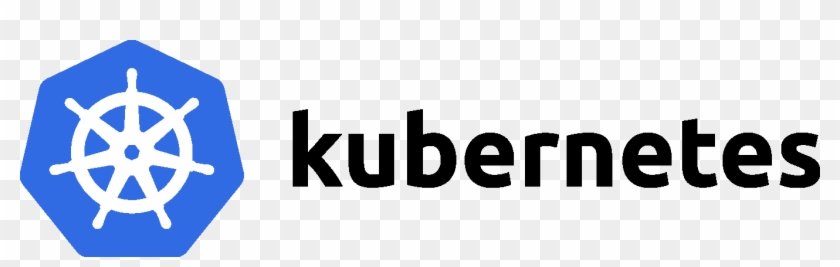
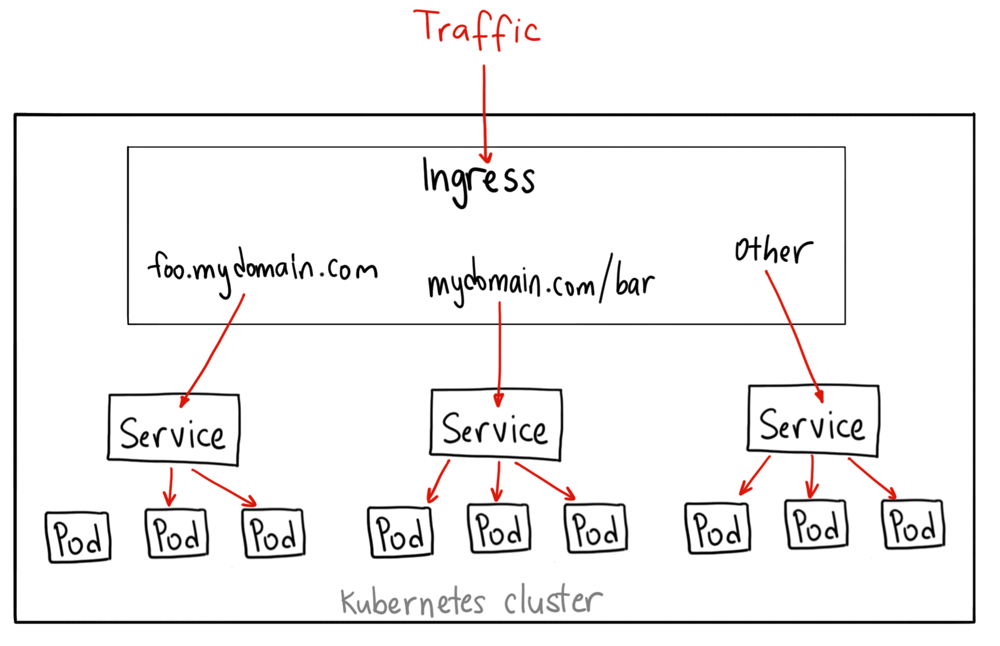
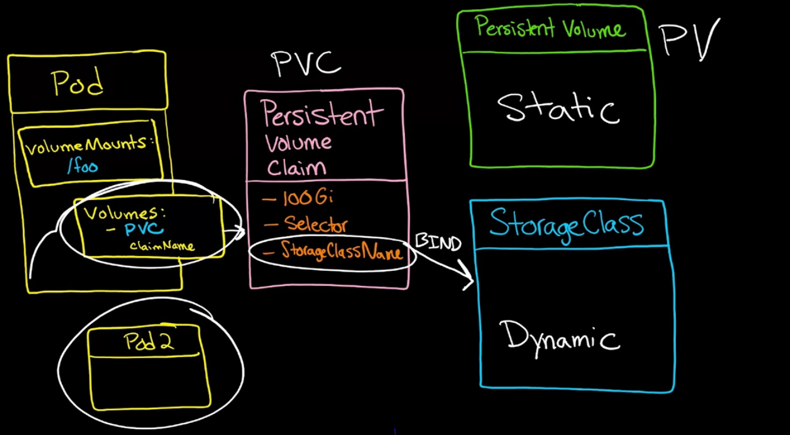
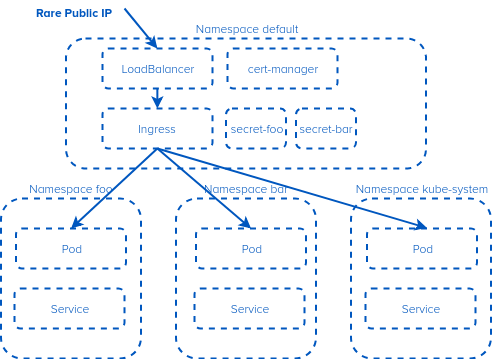

## Overview



* **Kubernetes**(k8s): Là một nền tảng mã nguồn mở được dùng để  quản lý các container, automating deployment, scaling, quản lý các ứng dụng được đóng gói và services.
* Các tiện ích: 
    - Triển khai ứng dụng nhanh
    - Scale ứng dụng dễ  dàng
    - Tôi ưu hóa việc sử dụng tài nguyên

## Architecture


### Master Node
* Máy chủ điều khiển các máy Worker chạy ứng dụng, bao gồm 4 thành phần chính

1. Etcd
* Cơ sở dữ liệu `key: value` của Kubernetes, tất cả thông tin cố  định của Kubernetes được lưu trữ cố  định vào đây.
* Nó chủ yếu được sử dụng để chia sẻ các cấu hình và **service discovery**

2. Kubernetes API Server
* Kết nối, giao tiếp giữa các thành phần
* Nơi tiếp nhận các lệnh REST được sử dụng để kiểm soát cluster

3. Controller Manager Service
* Quản lý và kiểm tra trạng thái các Worker, đảm nhận việc nhân bản ứng dụng

4. Scheduler Service
* Lập lịch triển khai cho các ứng dụng, ưng dụng được đặt vào Worker nào để chạy.

### Worker Node
* Máy chủ chạy ứng dụng trên đó.
* Là nơi mà các pod sẽ chạy. 
* Chứa tất cả các dịch vụ cần thiết để quản lý kết nối mạng giữa các container, giao tiếp với master node, và gán các tài nguyên cho các container theo kế hoạch.

1. Container runtime
* Thành phần giúp ứng dụng chạy dưới dạng container(thông thường là docker)

2. Kubelet
* Thành phần giao tiếp với **Kubernetes API Server**, và đảm bảo các containers up và running.
* Chịu trách nhiệm liên lạc với **Master Node**.
* Nó cũng liên lạc với etcd, để có được thông tin về dịch vụ và viết chi tiết về những cái mới được tạo ra.

3. Kubernetes Service Proxy
* Kube-proxy hoạt động như một proxy mạng và cân bằng tải cho một dịch vụ trên một work node.
* Nó liên quan đến việc định tuyến mạng cho các gói TCP và UDP.

4. Kubectl
* Giao diện dòng lệnh để giao tiếp với API service.
* Gửi lệnh đến **Master Node**.

## Node Server
1. Pod
* **Pod**: Là 1 nhóm (từ 1 trở lên) các container cùng chia sẻ tài nguyên mạng, lưu trữ. Pod được tạo ra hoặc xóa tùy thuộc vào yêu cầu. 
* Pods in a Kubernetes cluster are used in two main ways:
    - **Pods that run a single container**: Mô hình **one-container-per-pod**, 1 container tương ứng với 1 pod, Kubernetes quản lý pod thay vì quản lý container
    - **Pods that run mutiple containers that need to work together**: Một Pod có thể  đóng gói một ứng dụng bao gồm nhiều container được liên kết chặt chẽ và cần phải chia sẻ tài nguyên với nhau giữa các container.
* Pod cung cấp 2 loại tài nguyên chia sẻ cho các container:
    - **Networking**: Mỗi pod sẽ được gán 1 địa chỉ IP. Tất cả các container trong pod cùng chia sẻ network namespaces bao gồm địa chỉ IP và port. Các container trong cùng pod có thể  giao tiếp với nhau và giao tiếp với các container ở pod khác.
    - **Storage**: Mỗi pod có thể  chỉ định một **shared storage volumes**. Tất cả các container trong pod có thể  truy cập vào các **volumes** này.

2. Replication Controllers
* Là thành phần quản trị bản sao của Pod, giúp nhân bản hoặc giảm số lượng Pod.

3. Service



* Vì pod có tuổi thọ ngắn, do vậy sẽ không đảm bảo về  địa chỉ IP cố  định
* **Service**(svc): Là một lớp nằm trên một nhóm pod, được gán 1 IP tĩnh và có thể  trỏ vào domain của dịch vụ này.
* Mỗi service sẽ được gán 1 domain do người dùng lựa chọn, khi ứng dụng cần kết nối đến service, ta chỉ cần dùng domain là xong. Domain được quản lý bởi hệ thống name server SkyDNS nội bộ của k8s - một thành phần sẽ được cài khi ta cài k8s

4. Volumes



* Volumes thể hiện vị trí nơi mà các container có thể truy cập và lưu trữ thông tin.
* Volumes có thể là local filesystem, local storage, Ceph, Gluster, Elastic Block Storage,...
* **Persistent Volumes**(PV): Là khái niệm để  đưa ra một dung lượng lưu trữ **THỰC TẾ  1G, 10G,...** 
* **Persistent volume claim**(PVC): Là khái niệm ảo, đưa ra một dung lượng **CẦN THIẾT**, mà ứng dụng yêu cầu.

5. Namespaces



* Kubernetes hỗ  trợ nhiều cụm ảo trên cùng 1 cụm vật lý, các cụm ảo này là **namespaces**
* Đây là một công cụ dùng để nhóm hoặc tách các nhóm đối tượng. 
* Namespaces được sử dụng để kiểm soát truy cập, kiểm soát truy cập network, quản lý resource và quoting

6. ConfigMaps and Secrets
* **ConfigMaps** là giải pháp để  đưa 1 file config / đặt các ENV hay set các argument khi gọi câu lệnh. ConfigMap là một cục config, mà pod nào cần, thì chỉ định là nó cần - giúp dễ dàng chia sẻ file cấu hình.
* **Secrets** dùng để lưu trữ các password, token,... Nó nằm bên trong container.

7. Labels 
* **Labels**: Là các cặp `key: value` được gán vào các đối tượng. VD: pods, replication controllers, ...
```json
"metadata": {
  "labels": {
    "key1" : "value1",
    "key2" : "value2"
  }
}
```

### [me](https://github.com/ductnn)