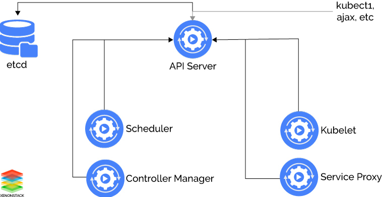
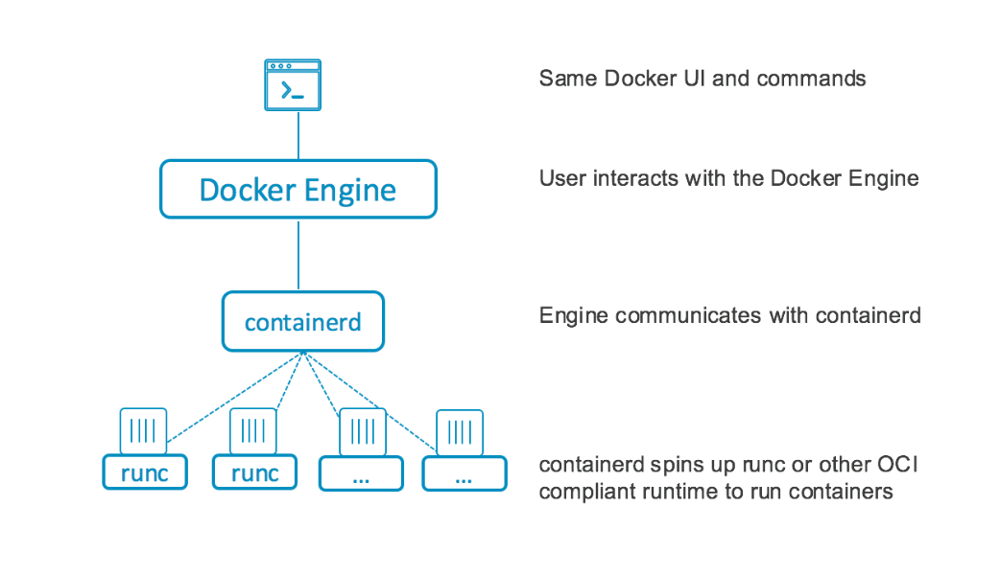

1. Container Orchestration
* Container Orchestration là các công cụ, dịch vụ dùng để  quản lý và điều phối nhiều container 
  - Cung cấp và triển khai container 
  - Phân bổ resources giữa các container
  - Tương tác các dịch vụ đang chạy trong một container ra bên ngoài
  - Cân bằng tải giữa các containers
  - Self-healing
  - Cấu hình ứng dụng liên quan đến container chạy nó
* Một số  loại Container Orchestration: Kubernetes, Docker Swarm, Google container Engine

2. Self-healing
* **Self-healing**: Khởi động lại các containers bị lỗi, thay thế các container, xoá các container không phản hồi lại cấu hình health check do người dùng xác định.
```yml
apiVersion: apps/v1
kind: Deployment
metadata:
  name: nginx
spec:
  selector:
    matchLabels:
      app: nginx
  replicas: 3
```
* Cấu hình `Deployment` trên sẻ được gửi tới thành phần API-Server của master Node, và sẽ gửi yêu cầu tạo trên node worker 3 pod chạy nginx
```bash
➜  seminar git:(master) ✗ kubectl get pods
NAME                     READY   STATUS    RESTARTS   AGE
nginx-644599b9c9-q6fr5   1/1     Running   0          60s
nginx-644599b9c9-v6xdw   1/1     Running   0          60s
nginx-644599b9c9-zcx52   1/1     Running   0          60s
```
* Thực thi `kubectl delete pod nginx-644599b9c9-q6fr5` xóa đi pod `nginx-644599b9c9-q6fr5`, và kiểm tra
```bash
➜  seminar git:(master) ✗ kubectl get pods                         
NAME                     READY   STATUS    RESTARTS   AGE
nginx-644599b9c9-pwkbb   1/1     Running   0          5s
nginx-644599b9c9-v6xdw   1/1     Running   0          4m19s
nginx-644599b9c9-zcx52   1/1     Running   0          4m19s
```
* K8s tự động tạo mới 1 pod `nginx-644599b9c9-pwkbb` để  duy trì số  lượng 3 pod chạy nginx 


3. Control Plane là gì ? Control plane bao gồm những thành phần nào ? Ngoài control plane thì còn plane khác không ?
* Control Plane: Tầng điều khiển các containers, dùng để  đưa ra API, interface để  triển khai và quản lý `lifecircle` của container
* Data Plane: Tầng này cung cấp về  CPU, memory, network và storage để  các container có thể  run và kết nối network, được tạo thành từ các Worker Node

* Cụm Kubernetes được chia ra thành các thành phần 
    - Master (Control Plane)
    - Node (Worker/Data Plane)
* **Control Plane**: Có 4 thành phần 
    - API Server
    - Controller Manager
    - Scheduler
    - etcd

4. Desired state
* **Desired state** của mỗi cụm Kubernetes xác định các ứng dụng hoặc các workloads đang chạy
* **Desired state** được xác định theo các file manifest.
* **Desired State** is the state that you want the system to be in
* **Actual State** is the state that the system is actually in

5. PodSpecs vs kubelet
* **kubelet** hoạt động theo các **PodSpecs**, đảm bảo các containers đã chạy trong pod ổn định.
* **kubelet** không quản lý các container mà không được tạo bởi k8s. 
* **PodSpecs** là file `yml` hoặc `json` bao gồm các thông tin để cài đặt, thư viện, thông tin về `metadata` như tên , version cho các Pod
```yml
apiVersion: v1
kind: Pod
metadata:
  name: app-nginx
  labels:
    app: app
spec:
  containers:
  - name: nginx
    image: nginx:1.16
    ports:
      - containerPort: 80
```
* File `.yml` trên mô tả pod `app-nginx` chạy container nginx tại `port:80` của container 

6. Selector
* **Labels**: Là các cặp `key: value` được gán vào các đối tượng. VD: pods, replication controllers, ...
```json
"metadata": {
  "labels": {
    "key1" : "value1",
    "key2" : "value2"
  }
}
```
* **Selector**: Là cặp `key: value` dùng để  chọn 1 `label` nhất định hoặc 1 tập các label
```yml
metadata: 
  name: varnish-deploy
spec:
  replicas: 1
  selector:
    matchLabels: 
      app: varnish-deploy
```
* Kubernetes API hỗ  trợ 2 loại `selector`
    - **Equality-based**: Filter theo `keys` và `values`
    - **Set-based**: Filter `keys` theo `values`

7. Kubelet tương tác đến pods hay tương tác đến tận container? Tại sao?
* Kubelet run pods. Pods được tạo theo các cấu hình được định nghĩa trong file manifest. Kubelet sẽ lấy các cầu hình từ API Server tạo container và đảm bảo các container được chạy ổn định. 
* Kubelet tương tác tới pods, và cũng có thể tương tác đến container 
Tạo lỗi pods
```sh
intern@intern-PC:~/Kubernetes-tu/seminar$ kubectl get pods
NAME                     READY   STATUS             RESTARTS   AGE
nginx                    0/1     ImagePullBackOff   0          51s
```
Apply lại 
```sh
intern@intern-PC:~/Kubernetes-tu/seminar$ kubectl get pods
NAME                     READY   STATUS    RESTARTS   AGE
nginx                    1/1     Running   0          2m54s
```
* Pods vẫn không thay đổi, kubelet chỉ tạo lại container nginx theo file manifest 
```sh
Events:
  Type     Reason     Age                   From               Message
  ----     ------     ----                  ----               -------
  Normal   Scheduled  3m14s                 default-scheduler  Successfully assigned default/nginx to minikube
  Warning  Failed     101s (x3 over 2m57s)  kubelet            Failed to pull image "nginx": rpc error: code = Unknown desc = Error response from daemon: Get https://registry-1.docker.io/v2/: net/http: request canceled while waiting for connection (Client.Timeout exceeded while awaiting headers)
  Warning  Failed     101s (x3 over 2m57s)  kubelet            Error: ErrImagePull
  Normal   BackOff    62s (x5 over 2m56s)   kubelet            Back-off pulling image "nginx"
  Warning  Failed     62s (x5 over 2m56s)   kubelet            Error: ImagePullBackOff
  Normal   Pulling    48s (x4 over 3m12s)   kubelet            Pulling image "nginx"
  Normal   Pulled     24s                   kubelet            Successfully pulled image "nginx" in 24.291630114s
  Normal   Created    22s                   kubelet            Created container nginx
  Normal   Started    22s                   kubelet            Started container nginx
```
8. Có gọi trực tiếp vào API server mà không phải thông qua Kubectl được không? Nếu có thì làm thế nào?
* Khi gọi vào API Server phải thông qua `kube-proxy` 
```sh
➜  seminar git:(master) ✗ kubectl proxy --port=8080 &
[1] 6804
➜  seminar git:(master) ✗ Starting to serve on 127.0.0.1:8080 
```
Kết quả 
```sh
➜  seminar git:(master) ✗ curl http://localhost:8080/api/         
{
  "kind": "APIVersions",
  "versions": [
    "v1"
  ],
  "serverAddressByClientCIDRs": [
    {
      "clientCIDR": "0.0.0.0/0",
      "serverAddress": "192.168.99.100:8443"
    }
  ]
}% 
```
* Tuy nhiên có thể gọi trực tiếp vào API Server mà không cần thông qua proxy bằng cách truyền trực tiếp `certificate` xác thực tới API Server 
* Thực thi command `kubectl config view` để lấy ip server và nơi lưu certificate
```sh
intern@intern-PC:~/Kubernetes-tu/seminar$ kubectl config view
apiVersion: v1
clusters:
- cluster:
    certificate-authority: /home/intern/.minikube/ca.crt
    server: https://192.168.99.100:8443
  name: minikube
contexts:
- context:
    cluster: minikube
    user: minikube
  name: minikube
current-context: minikube
kind: Config
preferences: {}
users:
- name: minikube
  user:
    client-certificate: /home/intern/.minikube/profiles/minikube/client.crt
    client-key: /home/intern/.minikube/profiles/minikube/client.key
```
Kết quả 
```sh
intern@intern-PC:~/Kubernetes-tu/seminar$ curl --cacert ~/.minikube/ca.crt --cert ~/.minikube/profiles/minikube/client.crt --key ~/.minikube/profiles/minikube/client.key https://192.168.99.100:8443/api/
{
  "kind": "APIVersions",
  "versions": [
    "v1"
  ],
  "serverAddressByClientCIDRs": [
    {
      "clientCIDR": "0.0.0.0/0",
      "serverAddress": "192.168.99.100:8443"
    }
  ]
}
``` 
* Lấy API của các pods 
```sh
intern@intern-PC:~/Kubernetes-tu/seminar$ curl -s --cacert ~/.minikube/ca.crt --cert ~/.minikube/profiles/minikube/client.crt --key ~/.minikube/profiles/minikube/client.key https://192.168.99.100:8443/api/v1/pods | jq .items[].metadata | jq '"\(.name), \(.namespace), \(.selfLink)"'
"nginx-644599b9c9-lfdb9, default, /api/v1/namespaces/default/pods/nginx-644599b9c9-lfdb9"
"nginx-644599b9c9-vgmr6, default, /api/v1/namespaces/default/pods/nginx-644599b9c9-vgmr6"
"nginx-644599b9c9-vm2r9, default, /api/v1/namespaces/default/pods/nginx-644599b9c9-vm2r9"
"coredns-f9fd979d6-4fgvq, kube-system, /api/v1/namespaces/kube-system/pods/coredns-f9fd979d6-4fgvq"
"etcd-minikube, kube-system, /api/v1/namespaces/kube-system/pods/etcd-minikube"
"kube-apiserver-minikube, kube-system, /api/v1/namespaces/kube-system/pods/kube-apiserver-minikube"
"kube-controller-manager-minikube, kube-system, /api/v1/namespaces/kube-system/pods/kube-controller-manager-minikube"
"kube-proxy-xbcjd, kube-system, /api/v1/namespaces/kube-system/pods/kube-proxy-xbcjd"
"kube-scheduler-minikube, kube-system, /api/v1/namespaces/kube-system/pods/kube-scheduler-minikube"
"storage-provisioner, kube-system, /api/v1/namespaces/kube-system/pods/storage-provisioner"
```

9. User-space, IPVS
### User-space


- `kube-proxy` sẽ kiểm tra *Kubernetes master* để  thêm và xóa các đối tượng **Service** và **Endpoint**, đối với mỗi dịch vụ, nó sẽ mở ngẫu nhiên 1 port trên node local. Bất kỳ kết nối nào đến "proxy port" đều được ủy quyền cho 1 trong các Pods. *kube-proxy* sẽ cài đặt `SessionAffinity` khi quyết định chọn pod. **User-space** proxy cài đặt các iptables rules để  xác định lưu lượng truy cập vào `clusterIP` và `port` của Services.

### IPVS (IP Virtual Server)


- `kube-proxy` kiểm tra **Service** và **Endpoint** của Kubernetes, giao diện **netlink** tạo các rules IPVS phù hợp và đồng bộ hóa các rules IPVS với **Service** và **Endpoint** Kubernetes theo định kỳ. Vòng điều khiển này đảm bảo rằng trạng thái IPVS phù hợp với trạng thái mong muốn. Khi truy cập Service, IPVS hướng lưu lượng truy cập đến một trong các pods.
- Mode proxy IPVS dựa trên chức năng **netfilter** tương tự như chế độ iptables, nhưng sử dụng bảng băm làm cấu trúc dữ liệu cơ bản và hoạt động trong **Kernel space**, kube-proxy ở mode IPVS chuyển hướng lưu lượng truy cập với độ trễ thấp hơn kube-proxy ở mode `iptables`, với hiệu suất tốt hơn nhiều khi đồng bộ hóa các rules proxy. So với modes proxy khác, IPVS cũng hỗ  trợ lưu lượng mạng cao hơn.

10. iptables là do ai tạo ra ? Trong slide 14, Client nghĩa là gì, đại diện cho cái gì?
* `iptables` là firewall sử  dụng các `rules` có nhiệm vụ xử  lý luồng gói tin đi qua mạng.
* Trong kubernetes, các rules của iptables được tạo và cấu hình bởi `kube-proxy`. Khi có thay đổi về  `Service` hoặc IP của pod, các `rules` của `iptables` sẽ cập nhật để  định tuyến lưu lượng.  


* `client` đại diện cho traffice từ bên ngoài qua các rules của `iptables` để  tới các pods bên dưới 

11. Kube-proxy quản lý toàn bộ traffic là đúng hay sai ?
* `kube-proxy` chỉ forward HTTP traffic 
* `kube port-forward` forward TCP traffic
* Tạo pod chạy container `httpd` với `Service: clusterIP` để  traffic bên ngoài không vào được
```yml
---
apiVersion: v1
kind: Service
metadata:  
  name: cluster
spec:
  selector:    
    app: app2
  type: ClusterIP
  ports:  
  - name: http
    port: 8000
    targetPort: 80
    protocol: TCP
---
apiVersion: v1
kind: Pod
metadata:
  name: myapp2
  labels:
    app: app2
spec:
  containers:
  - name: n1
    image: httpd
    ports:
      - containerPort: 8000
```
```sh
➜  app git:(master) ✗ kubectl get svc               
NAME         TYPE        CLUSTER-IP     EXTERNAL-IP   PORT(S)        AGE
cluster      ClusterIP   10.98.18.160   <none>        8000/TCP       9m15s
```
* `port-foward` có forward traffic sang port local và vào bên trong 
```bash
➜  app git:(master) ✗ kubectl port-forward svc/cluster 8000:8000
Forwarding from 127.0.0.1:8000 -> 80
Forwarding from [::1]:8000 -> 80
```
Kết quả
```bash
➜  app git:(master) ✗ curl 127.0.0.1:8000
<html><body><h1>It works!</h1></body></html>
```

12. LoadBalancer là những phần mềm gì ?
* **LoadBalancer** Layer4
* **LoadBalancer** thường dùng 1 số  công cụ mã nguồn mở như `nginx`, `octavia` và `HAproxy`
* VD: LoadBalancer nginx
```yml
```

13. Service expose cái gì ?
* `Service` **expose** ra port và ip của các pod tùy theo `type`
* Nếu `Service: clusterIP` thì chỉ expose ra ip và port bên trong, người dùng bên ngoài không thể  truy cập vào được
```sh
➜  app git:(master) ✗ kubectl get svc               
NAME         TYPE        CLUSTER-IP     EXTERNAL-IP   PORT(S)        AGE
cluster      ClusterIP   10.98.18.160   <none>        8000/TCP       9m15s
kubernetes   ClusterIP   10.96.0.1      <none>        443/TCP        3h14m
```  
* Nếu `Service: NodePort` thì vẫn expose ra ip và port bên trong, nhưng sẽ kèm theo 1 port mới là `nodeport: 31800`, người dùng có thể  truy cập vào trong pod thông qua nodeport.
```sh
➜  app git:(master) ✗ kubectl get svc               
NAME         TYPE        CLUSTER-IP     EXTERNAL-IP   PORT(S)        AGE
nodeport     NodePort    10.97.55.68    <none>        80:31080/TCP   11m
``` 
Kết quả
```sh
➜  app git:(master) ✗ curl $(minikube ip):31080
<html><body><h1>It works!</h1></body></html>
```
* Nếu `Service: LoadBalancer` thì expose ra ip và port bên trong và kèm theo **EXTERNAL-IP**, tuy nhiên đang chạy trên cụm `minikube` nên sẽ tạo ra 1 port bên ngoài để  người dùng có thể  truy cập vào giống như node port
```sh
➜  app git:(master) ✗ kubectl get svc                
NAME         TYPE           CLUSTER-IP       EXTERNAL-IP   PORT(S)          AGE
my-service   LoadBalancer   10.101.137.173   <pending>     8080:31017/TCP   4m39s
``` 
Kết quả
```sh
➜  app git:(master) ✗ curl $(minikube ip):31017
Hello Kubernetes!% 
```

14. Các thành phần trong master node? Có thể triển khai workload trên master node không? Tại sao?



* Ngoài các thành phần cơ bản thì trong master node cũng có hai thành phần `kube-proxy` và `kubelet`. Các node master cũng có các service được sử dụng để đảm bảo hoạt động của cụm k8s, do đó chúng được chạy trong các container và thuộc một pod có namespaces `kube-system`
```sh
➜  kubernetes git:(master) ✗ kubectl get pod --all-namespaces
NAMESPACE     NAME                               READY   STATUS    RESTARTS   AGE
kube-system   coredns-f9fd979d6-7dt8f            1/1     Running   0          9m57s
kube-system   etcd-minikube                      1/1     Running   0          9m57s
kube-system   kube-apiserver-minikube            1/1     Running   0          9m57s
kube-system   kube-controller-manager-minikube   1/1     Running   0          9m57s
kube-system   kube-proxy-srj26                   1/1     Running   0          9m57s
kube-system   kube-scheduler-minikube            1/1     Running   0          9m57s
kube-system   storage-provisioner                1/1     Running   0          10m
```  

* Có thể  triển khai workload lên master node được vì master node đủ các thành phần để  dựng và triển khai ứng dụng lên các pods
* Tạo 1 pods chạy nginx với namespaces là `kube-system` là namespaces thuộc master node 
```yml
apiVersion: v1
kind: Pod
metadata:
  name: myapp1
  namespace: kube-system
  labels:
    app: app1
spec:
  containers:
  - name: n1
    image: nginx
  ports:
    - containerPort: 80
``` 
Kiểm tra
```sh
➜  app git:(master) ✗ kubectl -n kube-system get pods
NAME                               READY   STATUS    RESTARTS   AGE
myapp1                             1/1     Running   0          12m
```

15. Mô hình em để trong slide là Deployment Arch, hay Logical Arch?


* Mô hình này vừa là Deployment Arch, vừa là Logical Arch
* **Node Master** chịu trách nhiệm quản lý cluster. Nó quản lý toàn bộ các hoạt động bên trong cluster, như là việc khởi chạy các ứng dụng, kiểm soát chúng để chắc chắn chúng luôn ở các trạng thái `desired`, scaling, hoặc triển khai các phiên bản update.
* Một Node có thể là một máy ảo (VM) hoặc một máy tính vật lý làm việc với vai trò cung cấp khả năng tính toán cho cluster. Mỗi một Kubernetes cluster được triển khai trong thực tế khai thác thường có ít nhất 3 node.
* Thường thì khi triển khai thực tế thì số lượng node worker sẽ nhiều hơn số lượng node master. Do vậy node master hay chính xác là K8S cần hoàn thành tốt nhiệm vụ liên quan tới việc quản lý, xử lý các container sao cho linh hoạt và trơn tru nhất. Ngoài ra, nếu như với các hệ thống thực tế cần có khả năng High Availability thì chúng ta cần triển khai nhiều node master

16.  Docker có phải là container runtime không ? So sánh Docker vs containerd
* **Container runtime**: Thành phần chạy và quản lý container 
* Docker là container runtime 



17.  Những dữ liệu lưu trong etcd là dữ liệu gì ? Tại sao phải dùng etcd ?
* Etcd là hệ thống cơ sở dữ liệu phân tán, nó lưu trữ `configuration data`, `state`
* Data được đọc từ command `kubectl` đều được lấy ra từ `etcd`
* Những thay đổi khi sau khi dùng command `kubectl apply` sẽ được tạo hoặc update vào etcd
```bash
➜  kubernetes git:(master) ✗ kubectl -n kube-system get pod
NAME                               READY   STATUS    RESTARTS   AGE
coredns-f9fd979d6-qbvpp            1/1     Running   0          69m
etcd-minikube                      1/1     Running   0          69m
kube-apiserver-minikube            1/1     Running   0          69m
kube-controller-manager-minikube   1/1     Running   0          69m
kube-proxy-vg95m                   1/1     Running   0          69m
kube-scheduler-minikube            1/1     Running   0          69m
storage-provisioner                1/1     Running   1          69m
```
* Etcd cũng lưu trữ 2 trạng thái của hệ thống `actual` và `desired`
* Kiểm tra data lưu trong etcd
Set ADVERTISE_URL
```bash
$ ADVERTISE_URL="https://$(minikube ip):2379"
```

Lưu file cấu hình của etcd ra file `etcd-kv.json`
```bash
kubectl exec -it -n kube-system etcd-minikube -- sh -c \
"ETCDCTL_API=3 etcdctl \
--endpoints $ADVERTISE_URL \
--cacert /var/lib/minikube/certs/etcd/ca.crt \
--key /var/lib/minikube/certs/etcd/server.key \
--cert /var/lib/minikube/certs/etcd/server.crt \
get \"\" --prefix=true -w json" > etcd-kv.json
```

File [etcd-kv.json](./etcd-kv.json) có dạng
```json
{
  "header": {
    "cluster_id": 18038207397139142846,
    "member_id": 12593026477526642892,
    "revision": 1093,
    "raft_term": 2
  },
  "kvs": [
    {
      "key": "L3JlZ2lzdHJ5L2FwaXJlZ2lzdHJhdGlvbi5rOHMuaW8vYXBpc2VydmljZXMvdjEu",
      "create_revision": 4,
      "mod_revision": 4,
      "version": 1,
      "value": "eyJraW5kIjoiQVBJU2VydmljZSIsImFwaVZlcnNpb24iOiJhcGlyZWdpc3RyYXRpb24uazhzLmlvL3YxYmV0YTEiLCJtZXRhZGF0YSI6eyJuYW1lIjoidjEuIiwidWlkIjoiMGEyNzU0NmMtODlhZS00N2EwLTkxM2YtN2RmMWZlNDJjYTFlIiwiY3JlYXRpb25UaW1lc3RhbXAiOiIyMDIwLTEyLTEwVDA5OjM1OjU2WiIsImxhYmVscyI6eyJrdWJlLWFnZ3JlZ2F0b3Iua3ViZXJuZXRlcy5pby9hdXRvbWFuYWdlZCI6Im9uc3RhcnQifX0sInNwZWMiOnsidmVyc2lvbiI6InYxIiwiZ3JvdXBQcmlvcml0eU1pbmltdW0iOjE4MDAwLCJ2ZXJzaW9uUHJpb3JpdHkiOjF9LCJzdGF0dXMiOnsiY29uZGl0aW9ucyI6W3sidHlwZSI6IkF2YWlsYWJsZSIsInN0YXR1cyI6IlRydWUiLCJsYXN0VHJhbnNpdGlvblRpbWUiOiIyMDIwLTEyLTEwVDA5OjM1OjU2WiIsInJlYXNvbiI6IkxvY2FsIiwibWVzc2FnZSI6IkxvY2FsIEFQSVNlcnZpY2VzIGFyZSBhbHdheXMgYXZhaWxhYmxlIn1dfX0K"
    },
    "..."
  ],
  "count": 303
} 
``` 
* Các cặp `key/value` được mã hóa dưới dạng `base64`

Decode key
```bash
/registry/apiregistration.k8s.io/apiservices/v1.
```
Decode value
```json
{
  "kind": "APIService",
  "apiVersion": "apiregistration.k8s.io/v1beta1",
  "metadata": {
      "name": "v1.",
      "uid": "0a27546c-89ae-47a0-913f-7df1fe42ca1e",
      "creationTimestamp": "2020-12-10T09:35:56Z",
      "labels": {
          "kube-aggregator.kubernetes.io/automanaged": "onstart"
      }
  },
  "spec": {
      "version": "v1",
      "groupPriorityMinimum": 18000,
      "versionPriority": 1
  },
  "status": {
      "conditions": [
          {
              "type": "Available",
              "status": "True",
              "lastTransitionTime": "2020-12-10T09:35:56Z",
              "reason": "Local",
              "message": "Local APIServices are always available"
          }
      ]
  }
}
```

* Trong `etcd` lưu các file cấu hình và trạng thái (VD: [File](./key.txt)) của các resource trong cụm bao gồm: 
  - Nodes
  - Namespaces
  - ServiceAccounts
  - Roles and RoleBindings, ClusterRoles / ClusterRoleBindings
  - ConfigMaps
  - Secrets
  - Deployments, DaemonSets, Pods, ... (Workloads)
  - apiVersion
  - events

### Reference
* [Kubernetes Components](https://kubernetes.io/docs/concepts/overview/components/)
* [Kunernetes Services](https://kubernetes.io/docs/concepts/services-networking/service/)
* [Kubernetes Glossary](https://kubernetes.io/vi/docs/reference/glossary/?fundamental=true)
* [Docker vs Containerd](https://computingforgeeks.com/docker-vs-cri-o-vs-containerd/)
* [The Kubernetes Networking Model](https://sookocheff.com/post/kubernetes/understanding-kubernetes-networking-model/)
* [Kubernetes Architecture](https://github.com/hocchudong/ghichep-kubernetes/blob/master/docs/kubernetes-5min/03.Kientrucvacacthanhphan.md)
* [Kubernetes Cluster](https://kubernetes.io/vi/docs/tutorials/kubernetes-basics/create-cluster/cluster-intro/)
